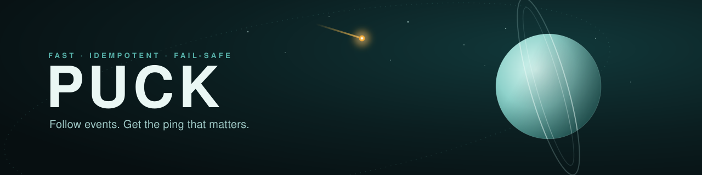

<div align="center">

<picture>
  <source media="(prefers-color-scheme: dark)" srcset="assets/puck-banner-dark.svg">
  <source media="(prefers-color-scheme: light)" srcset="assets/puck-banner-light.svg">
  
</picture>

<br><br>

[](https://github.com/vaoan/Puck/actions/workflows/ci.yml)
&nbsp;
&nbsp;
&nbsp;
&nbsp;
&nbsp;

<br>

**Schedule the event. Puck reminds everyone at exactly the right minute.**

Puck is an event-scheduling platform with a reminder engine built in. Organizers
author multi-day **events** and the **sessions** inside them; people subscribe to
what they care about and get a nudge before it starts — over **Telegram** and
**email**, with more channels designed to drop in later.

<sub>Named after Puck, the small, quick inner moon of Uranus — fast, reliable, and out of your way.</sub>

</div>

---

## The whole idea, in one ladder

A session has a start time. The only question that matters is _how far ahead do
you want to know_ — so that's the spine of the whole product:

```
                                              session
   T‑30        T‑15        T‑10        T‑5     ▶ start
    │           │           │           │        │
    └───────────┴──── pick any, per subscription ┴──── ping
```

People subscribe at **two levels**, and Puck does the rest:

```
  ┌ subscribe to an EVENT    → one daily digest each morning it runs
  └ subscribe to a SESSION   → reminders at the lead times you pick above
```

No upstream feed, no scraping — Puck **owns** the schedule. Organizers author it;
Puck watches the clock and fans the reminders out.

## Who does what

| Role                         | Can                                                                               |
| ---------------------------- | --------------------------------------------------------------------------------- |
| **Event owner**              | Create the event, manage its schedule, appoint delegates, moderate what gets sent |
| **Event delegate**           | Edit the event and any session in it; override session-level settings             |
| **Session owner / delegate** | Edit their session and upload documents to it anytime                             |
| **Anyone**                   | Create their own session inside an event; discover events and subscribe           |

Authoring is governed by a CandyStore-style permission system — owners and
delegates, enforced in the database with row-level security — not a single
all-powerful admin.

## Build roadmap

Puck is one platform decomposed into four sub-projects, each with its own
spec → plan → build cycle. They ship in dependency order.

| #      | Sub-project           | What it delivers                                                                               | Status         |
| ------ | --------------------- | ---------------------------------------------------------------------------------------------- | -------------- |
| **01** | **Foundation**        | Identity, the CandyStore-style RBAC, and the event → session → occurrence domain (RLS + audit) | ✅ complete    |
| **02** | **Authoring web app** | Next.js admin: build the schedule, manage delegates, upload documents, moderate                | 🔨 in progress |
| **03** | **Reminder engine**   | Two-level subscriptions, `pgmq` + `pg_cron` scheduling, fan-out, dedupe, delivery              | 💭 idea        |
| **04** | **Telegram bot**      | Discover events, browse the schedule, subscribe, set lead times, link your account             | 💭 idea        |

> **Status: in development.** The **Foundation (01)** is built — 12 Supabase
> migrations (identity, RBAC, event → session → occurrence domain, RLS, audit)
> plus the `@puck/auth` and `@puck/db` packages. The **Authoring web app (02)** is
> now underway on its first slice — app shell + social auth + account — with
> `@puck/ui` (design tokens + base components) and the `apps/web` scaffold landed.
> Start with
> [`docs/2026-06-19-platform-roadmap.md`](docs/2026-06-19-platform-roadmap.md),
> then the specs and plans under [`docs/superpowers/`](docs/superpowers/).

## Design principles

These are the rules the build will hold to — chosen so the platform stays cheap
to run and impossible to spam.

| Principle               | What it means                                                                                              |
| ----------------------- | ---------------------------------------------------------------------------------------------------------- |
| 🧭 **Hexagonal core**   | The domain depends on ports, not SDKs — so channels and the queue are swappable by design.                 |
| 🧱 **Outbox-durable**   | A schedule change and its fan-out job commit in one transaction — never lost, never phantom.               |
| 🔁 **Idempotent**       | Every reminder carries a deterministic `dedupe_key` with a UNIQUE constraint. A reminder can't fire twice. |
| ♻️ **Durable retries**  | Failed sends back off and re-queue; permanent failures and exhausted attempts dead-letter for inspection.  |
| 🪶 **Zero extra infra** | The queue (`pgmq`) and scheduler (`pg_cron`) live inside Supabase Postgres. No Redis, no new bills.        |
| 🛰️ **Multi-channel**    | Telegram & email first; a new channel is a class that implements one port, not a rewrite.                  |

## Toolchain

> Requires **Node 24** (see `.nvmrc`) and **pnpm 10**. Local Supabase needs the
> [Supabase CLI](https://supabase.com/docs/guides/cli) and Docker.

```bash
pnpm install      # install workspace deps
pnpm typecheck    # tsc --noEmit across the workspace
pnpm test         # vitest
pnpm lint         # eslint (flat config)
pnpm db:start     # local Supabase: Postgres + pgmq + pg_cron + Auth
```

A pnpm + Turbo monorepo with strict TypeScript (ESM / NodeNext), zod at every
boundary, and Vitest. The `@puck/auth`, `@puck/db`, and `@puck/ui` packages plus
the `apps/web` scaffold are in place, so the scripts above now run against real
workspaces.

> ⚠️ **Puck uses its own Supabase project.** Never point `SUPABASE_URL` /
> `SUPABASE_SERVICE_ROLE_KEY` at CandyStore or any shared / production database.

### Running the web app (`apps/web`)

The web app talks directly to Supabase, so start the local stack first, then the
dev server on port 5000:

```bash
pnpm db:start                     # local Supabase (Docker) — prints URL + keys
pnpm db:reset                     # apply migrations
pnpm --filter @puck/web dev       # http://localhost:5000
```

Set `NEXT_PUBLIC_SUPABASE_URL` and `NEXT_PUBLIC_SUPABASE_ANON_KEY` (from
`supabase start`) in your `.env` — see `.env.example`. **Manual browser login
needs real Google/Discord OAuth credentials** configured in Supabase Auth; the
automated tests do not.

```bash
pnpm --filter @puck/web test      # unit tests (Vitest + RTL)

# E2E (Playwright) — needs local Supabase up + SUPABASE_SERVICE_ROLE_KEY set
# (the auth fixture seeds a real session via the admin API):
pnpm --filter @puck/web test:e2e
```

## Repo boilerplate

The dev-backbone rails are already in place:

- **Lint / format / CI** — ESLint flat config, Prettier, Husky pre-commit hooks, Turbo-driven CI workflows, and deploy templates for Vercel and Docker/Supabase infra.
- **Env + secrets** — `.env.{dev,ci,prod}` files validated by `scripts/load-env.mjs`; secret references use the `$secret:KEY` syntax so real values stay in `.secrets` (gitignored) and never reach the repo.
- **Codegen template** — `orval.config.ts` at the root is a genericized REST-codegen template; wire `PUCK_OPENAPI_URL` and drop `specs/openapi.yaml` when sub-project 02 adds an OpenAPI source.
- **Claude assistant layer** — `.claude/` holds MCP server config and project-specific guidance for the AI assistant.

<details>
<summary><b>Sister projects & conventions</b></summary>

<br>

Puck shares its toolchain DNA with **CandyStore** and **Janus** — the same pnpm +
Turbo monorepo, strict TypeScript, ESLint flat config + Prettier, Vitest, Husky,
secretlint/cspell, the `.env` + `.secrets` discipline, kebab-case filenames, and
Supabase (Auth + RLS + Storage). Like them, Puck has a Next.js web app
(sub-project 02); unlike them, it also runs backend services — a Fastify API and a
Node worker — for the reminder engine.

</details>

## License

[MIT](LICENSE) © Heiner Angarita
