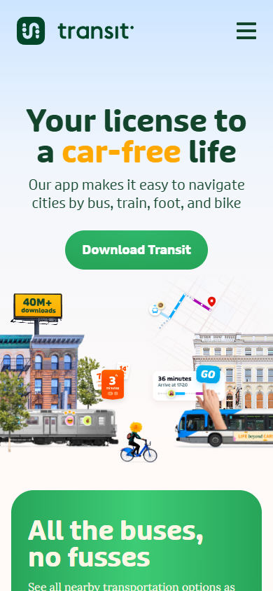
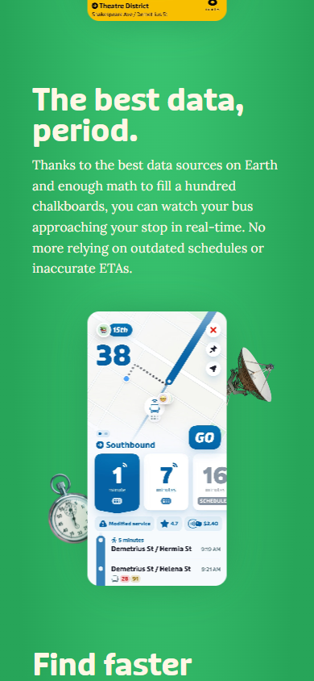
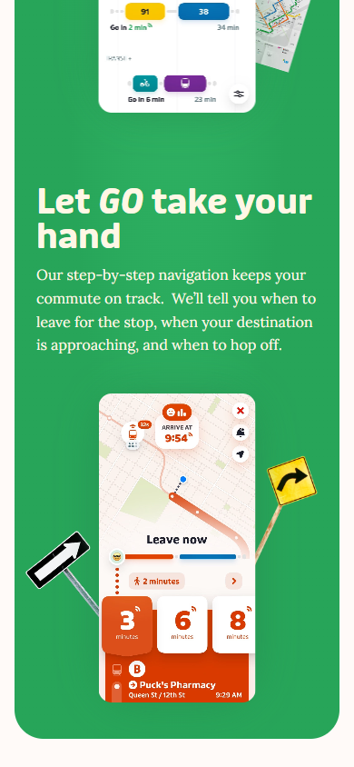

# Puck Design Guidelines

**Status:** Canonical. This is the **binding design standard** for all Puck UI.
**Single source of truth** for color, type, shape, motion, and voice.

> Any Puck surface — starting with sub-project #2 (`apps/web`), and later the
> Telegram bot's rich messages — MUST follow these guidelines. `globals.css`
> (Tailwind v4 `@theme inline`) and the component library derive directly from
> the tokens here. When something is ambiguous, this document wins.
>
> Decision record / rationale for choosing this direction:
> [`2026-06-30-puck-visual-direction.md`](./2026-06-30-puck-visual-direction.md).

---

## 1. The look in one line

**Friendly but still serious** — the [Transit app](https://transitapp.com) model.
Transit earns trust because **color does a job**: every transit line owns a
color, so the screen is vivid yet every hue _means_ something (which line, how
soon). That functional-color discipline is the whole game. Puck applies it to a
festival/conference schedule.

Puck is **phone-first**. The hero is **the schedule itself** — not a marketing
pitch (unlike Eclipse Con), not a storefront (unlike CandyStore's neobrutalism).

### Reference: how Transit does it

| Transit hero                                                               | In-app departure board                                                      | Color-coded lines + "now" signal                                         |
| -------------------------------------------------------------------------- | --------------------------------------------------------------------------- | ------------------------------------------------------------------------ |
|                                  |             |    |
| Warm canvas, dark ink, one rounded CTA pill, heavy rounded-grotesk display | Giant route number, departure cards with colored badges, time-led stop list | Each line a color (`91`/`38`/`28`/purple); orange = imminent/"Leave now" |

### Transit → Puck mapping

| Transit                    | Puck                             |
| -------------------------- | -------------------------------- |
| Transit line (color-coded) | **Track / stage** (color-coded)  |
| Next departures, big times | **Next sessions**, big times     |
| "Leave in 4 min" alert     | **"Starts in 10 min"** reminder  |
| GO / nearby board          | **Today / now-next** home screen |
| Service alerts             | **Daily digest / broadcasts**    |

### Keep the system, own the fingerprint

**Keep from Transit:** functional color (each track a hue + one hot "now"
signal), chunky rounded flat cards, oversized tabular numerals for times,
one-column thumb-first layout.

**Puck's own fingerprint:** an **iris/indigo** brand anchor (nod to _A Midsummer
Night's Dream_) instead of Transit's green; the pinned **"now" card**; and the
**Puck messenger-sprite + 40-minute orbit** reminder moment ("a girdle round
about the earth in forty minutes").

---

## 2. Color

> Authored as **OKLCH** CSS variables in `globals.css` per
> [`.claude/rules/tailwind.md`](../../.claude/rules/tailwind.md). Hex below is for
> reading/approval. All foreground/background pairs must pass **WCAG 2.1 AA**
> (4.5:1 text, 3:1 UI), in light and future dark themes.

### 2.1 Brand & chrome — neutral, never decorative

| Token         | Hex       | Role                                    |
| ------------- | --------- | --------------------------------------- |
| `--canvas`    | `#FBFAF7` | app background (warm off-white)         |
| `--surface`   | `#FFFFFF` | card fills                              |
| `--ink`       | `#1C1B2E` | primary text (indigo-black, not pure)   |
| `--ink-muted` | `#5B5A6E` | secondary text, labels                  |
| `--hairline`  | `#E9E7F0` | dividers, card borders                  |
| `--brand`     | `#4338CA` | Puck iris — primary actions, active nav |
| `--brand-ink` | `#FFFFFF` | text/icon on `--brand`                  |

### 2.2 Signal colors — status meaning only (like Transit's orange)

| Token        | Hex       | Means                                        |
| ------------ | --------- | -------------------------------------------- |
| `--now`      | `#F0682B` | **live / starting soon** — the one hot color |
| `--upcoming` | `#4338CA` | subscribed / scheduled                       |
| `--ended`    | `#9893A8` | past sessions (desaturated)                  |
| `--success`  | `#1F9D63` | confirmation ("reminder set")                |

`--now` is rationed — at most one element on screen wears it at a time.

### 2.3 Track palette — color-codes stages (like Transit's lines)

Fixed, accessible 6-color ring, assigned round-robin to tracks/stages:

| Slot | Hex       | Name   |
| ---- | --------- | ------ |
| 1    | `#4338CA` | iris   |
| 2    | `#0E8AD6` | blue   |
| 3    | `#1F9D63` | green  |
| 4    | `#C7456E` | rose   |
| 5    | `#E0941A` | amber  |
| 6    | `#7C4DD1` | violet |

**Rule:** a track keeps its color everywhere — badge, schedule rail, filter chip,
calendar dot. Color encodes _which stage_, never decoration or mood.

---

## 3. Typography

- **Display / numerals:** a **rounded grotesk** echoing Transit's
  friendly-but-serious tone — **Hanken Grotesk** or **Figtree** (free, variable,
  rounded terminals). Heavy (700–800) for session titles and times.
- **Times use tabular figures** (`font-variant-numeric: tabular-nums`) so
  departure stacks align — this is where glanceable legibility comes from.
- **Body:** same family at 400–500, or **Inter** for a quieter body contrast.

### Type scale (mobile baseline)

| Role         | Size / line | Weight | Notes                                  |
| ------------ | ----------- | ------ | -------------------------------------- |
| time-display | 40 / 44     | 800    | tabular-nums                           |
| time-row     | 32 / 36     | 700    | tabular-nums                           |
| title        | 22 / 28     | 700    | session/event titles                   |
| section      | 17 / 24     | 600    |                                        |
| body         | 15 / 22     | 400    |                                        |
| label        | 13 / 16     | 600    | uppercase, +4% tracking, `--ink-muted` |

---

## 4. Shape, spacing, elevation

- **Radius:** cards `20px`, pills/badges `999px`, inputs `14px`.
- **Spacing:** 4px base grid; card padding `16`; section gap `24`; thumb targets
  **≥48px**.
- **Elevation:** flat. Structure from color blocks, hairlines, spacing — **not**
  shadows. At most one soft shadow on the floating "now" card.

---

## 5. Signature elements (Puck's fingerprint)

1. **The "now" card** — a single `--now` card pinned to the top of the home
   board: _"Starts in 10 min · Keynote · Main Stage,"_ mirroring "Leave now."
2. **Puck sprite + 40-minute orbit** — when a reminder fires or a digest sends, a
   small sprite traces a quick arc. One flourish only; respect
   `prefers-reduced-motion`.
3. **Voice / microcopy** — active, the app speaks _as_ Puck:
   - _"I'll nudge you 10 min before."_
   - _"Reminder set."_
   - Empty: _"Nothing scheduled yet — subscribe to a track and I'll keep watch."_
   - Errors don't apologize, never vague: _"Couldn't reach Telegram. We'll
     retry — your reminder is still set."_

---

## 6. Home screen layout (one-column, thumb-first)

```
┌─────────────────────────────┐
│ Festival name      [profile] │  ← neutral header
│ Fri 19 · ◐ Day 2/4           │  ← day switcher (chips)
├─────────────────────────────┤
│ ▌NOW  Keynote · Main Stage   │  ← --now card
│  starts in 10 min   [remind] │
├─────────────────────────────┤
│ NEXT                         │
│ ▌09:30  Workshop A   ●iris   │  ← track-color rail + tabular time
│ ▌10:00  Panel        ●blue   │
│ ▌11:15  Lunch        ●green  │
│ … today's vertical timeline …│
└─────────────────────────────┘
  [ Today ] [ Tracks ] [ Mine ]   ← bottom tab bar, brand-active
```

---

## 7. Quality floor (non-negotiable)

- Responsive down to 360px; one-column thumb-first throughout.
- Visible keyboard focus on every interactive element.
- `prefers-reduced-motion` respected (orbit/sprite degrade to a static state).
- All token pairs verified WCAG AA, light and dark.
- Color is reserved for **track + status**. The moment color decorates, it tips
  into toy — that discipline is what keeps Puck "serious."

---

## 8. References

- **Transit app** — https://transitapp.com (locked aesthetic model)
- Reference screenshots: [`./assets/`](./assets) (captured at 390px viewport)
- Calm-software restraint: Linear, Notion Calendar, Things 3
- Name/personality: Puck, _A Midsummer Night's Dream_ — nimble messenger sprite

---

## Related

- [`2026-06-30-puck-visual-direction.md`](./2026-06-30-puck-visual-direction.md) — decision record (why Transit)
- [`docs/2026-06-19-platform-roadmap.md`](../2026-06-19-platform-roadmap.md) — sub-project decomposition (#2 = `apps/web`)
- [`.claude/rules/tailwind.md`](../../.claude/rules/tailwind.md) — OKLCH + semantic color enforcement
- [`.claude/rules/single-source-of-truth.md`](../../.claude/rules/single-source-of-truth.md) — tokens as one source of truth
- [`.claude/rules/css-consistency.md`](../../.claude/rules/css-consistency.md) — keep tokens identical across apps
